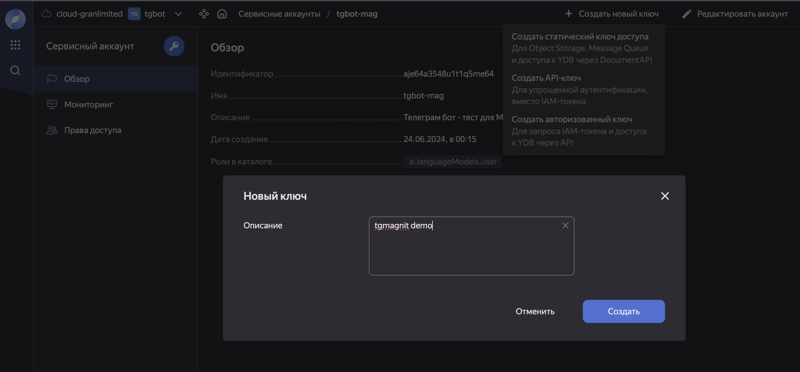

# Создание вопрос-ответного бота
Версия документа v.240623

В рамках этого проекта мы создаём чат-бота, ориентированного на формирование ответов на вопросы в узкоспециализированной тематике. Такие чат-боты могут быть реализованы двумя путями:

* **Дообучение разговорной модели** - это требует переобучения модели, большого датасета в предметной области и огромные вычислительные ресурсы для обучения. 
* **Retrieval-Augmented Generation** - это поиск, подолненный генерацией ответа с помощью LLM-модели. Ответ чат-бота формируется  предобученной LLM-моделью, но предварительно ей подаются фрагменты текста из предметно-ориентированной базы знаний, найденные с помощью семантического поиска.

## Этапы создания бота

Вся работа состоит из следующих основных этапов:

1. [LangChainQA.ipynb](LangChainQA.ipynb) - код на базе LangChain, который разбивает текстовые документы на фраги=менты, векторизует их с помощью эмбеддингов и сохраняет в векторную базу данных (в данном проекте в `LanceDB`). Так же, реализована часть бота, которая моделирует формирование ответа на запрос:
        * в ответ на запрос извлекает из БД релевантные фрагменты документов,
        * подаёт отобранные фрагменты на вход LLM модели (у нас - в YandexGPT). 
1. [telegram.py](telegram.py) - код телеграм-бота на основе фреймворка flask. Этот скрипт размещается на виртуальной машине или в докере.

Чтобы начать работу, необходимо ннастроить работу с LLM YandexGPT:

1. Создат каталог - мы создали каталог `tgbot`
    * 
1. Создать в облаке [сервисный аккаунт](https://cloud.yandex.ru/docs/iam/concepts/users/service-accounts), имеющий доступ к YandexGPT и объектному хранилищу,
    * 
    * при создании каталоги устанавливаем для него роль `languageModel.user`:
    * 
1. Cоздать [API-ключ](https://cloud.yandex.ru/docs/iam/concepts/authorization/api-key) ([инструкция](https://cloud.yandex.ru/docs/iam/operations/api-key/create)):
    * 
    * 
1. Параметры этого ключа прописываются в файле [config.json](config.json). (Вместо `API-ключа` можно использовать [создать статический ключ доступа](https://cloud.yandex.ru/docs/iam/operations/sa/create-access-key)).


## Работа`LangChainQA.ipynb`
1. В результате выполнеия кода выполняются следующие действия:
    * векторизация тектовых документов, которые должны быть заранее загружены в формате `txt` в директорию `/store`,
    * сохранение векторизованных данных в БД `LanceDB`,
    * проверка качества ответов бота.

Детали работы кода есть в Jupyter-буке.


## Вопрос-ответный Telegram-бот
Полная документация по телеграм-ботам смотрите по [этой ссылке](https://core.telegram.org/bots/tutorial).

Код нашего бота - в файле`telegram.py`. Этот файл и другие необходимые для работы бота файлы должны быть размещены в публично-доступной по HTTPS *виртуальной машине* или *докере*.

## Размещение кода на виртуальной машине

1. Требования к виртуальной машине для проведения экспериментов с телеграм-ботом невысокие: OS Ubuntu, RAM 6 Gb, SSD 50 Gb.
1. Для виртуальной машины лучше настроить статический IP-адрес
1. Заходим в консоль виртуальной машины по SSH
1. Клонируем репозиторий проекта
1. Переходим в каталог проекта и устанавливаем зависимости:
    * `pip3 install -r requirements.txt`
    * `pip3 install yandex-chain`
    * `pip3 install -U langchain-community`
1. Создаём бота в телеграм при помощи `botfather` (см. [документацию](https://core.telegram.org/bots/tutorial#getting-ready)), и полученный telegram token записываем в [`config.json`](config.json)
1. Копируем векторную базу данных, полученную на предыдущем шаге, в директорию `store`.
1. Запускаем `python3 telegram.py`. На этом этапе можно отправить боту текстовое сообщение и он должен дать ответ.

Бот работает в режиме отладки, если раскомментирован этот участок кода:
```
# ЗАПУСК ПРИЛОЖЕНИЯ В РЕЖИМе ОТЛАДКИ
if __name__ == "__main__":
    app.run(host="0.0.0.0", port=88)
```
 >>> НЕ ИСПОЛЬЗУЙТЕ режим разработки в производственной среде!


Чтобы бот работал как сервис, необходимо, чтобы был раскомментирован этот фрагмент кода:
```
# ЗАПУСК ПРИЛОЖЕНИЯ В ПРОДАКШЕНЕ
if __name__ == "__main__":    
    from waitress import serve  
    serve(app, host="0.0.0.0", port=88, threads=7) 
```
### Что необходимо для запуска приложения как сервис

Для развертывания приложения в рабочей среде одним из вариантов является использование Waitress, рабочего сервера WSGI.

Потребуется установить модули:
```bash
pip install waitress
pip install aiogram
```
Вот пример использования `waitress` в коде:
```Python
from flask import Flask
app = Flask(__name__)
@app.route("/")
def index():
    return "<h1>Hello!</h1>"
if __name__ == "__main__":      # для запуска в режиме producion
    from waitress import serve  # для запуска в режиме producion
    serve(app, host="0.0.0.0", port=88)   # для запуска в режиме producion
``` 
Running the application:
```bash
$ python hello.py
```

`Waitress`  предоставляет утилиту командной строки `waitress-serve`. Чтобы использовать её, вы можете изменить код следующим образом::
```Python
from flask import Flask
app = Flask(__name__)
@app.route("/")
def index():
    return "<h1>Hello!</h1>"
def create_app():
   return app
```

Тогда мы можем использовать функцию `waitress-serve` следующим образом::

```bash
waitress-serve --port=88 --call hello:create_app
```

Для информации - по-умолчанию, используется порт 8080.

__Чтобы проверить развертывание, откройте отдельное окно:__

```bash
% curl localhost:88
```
Получите ответ:
```html
<h1>Hello!</h1>
```


__Другой способ проверить развёртывание__ - в  браузере http://localhost:8080/.

Другие варианты развертывания вашего приложения включают `Gunicorn` и `uWSGI`. Для получения более подробной информации, пожалуйста, обратитесь к документации по развертыванию `flask`.


### Запускаем приложения как сервис

*Способ через Systemd:*

1. Создаём файла службы `]aztgbot.service]` и размещаем его в `/etc/systemd/system/`.

> В файле указываем имя сервиса, описание, путь к исполняемому файлу Python, пользователя и группу, под которыми будет работать сервис, а также другие параметры. Пример:

```shell
[Unit]
Description=AZUR air Telegram Bot

[Service]
Type=simple
ExecStart=/usr/bin/python3 /home/azurbot/aztgbot/telegram.py
User=azurbot
Group=azurbot

[Install]
WantedBy=multi-user.target
```


Запуск и управление сервисом:
```shell
sudo systemctl start aztgbot.service
sudo systemctl stop aztgbot.service
sudo systemctl status aztgbot.service
```

## Размещение приложения в докере

На вашей разработческой машине должен быть установлен `Docker`. Если удобнее работать в гшрафическом интерфейсе, то используйте `['Docker Desktop'](https://www.docker.com/products/docker-desktop/). 

Для запуска докера на локальном компьютере перейдите в директорию локального репозитория и наберите инструкцию:
```
docker compose up --build
```

После развёртывания докеров откройте другое терминальрное окно для проверки работоспосбности докеров.
```
curl localhost:8080
```
Должен быть получен ответ:
```shell
Hello, this is a bot!
```


Зайти в терминал докера можно командой:
```
docker exec -it tgbot_azur /bin/bash
```
Наберите команду `ls` чтобы просмотреть содержание директории `app`:
```
Dockerfile            compose.yaml              store  
LangChainQA.ipynb     README.md                 config.json
txts                  imgsinfo                  telegram.py
requirements.txt          temp
```

## Как работает приложение
Приложение устанавливает связь с сервером Telegram с помощью вебхуков. Вебхук — это метод, который позволяет серверу Telegram отправлять HTTP-запросы на сервер вашего приложения каждый раз, когда поступает новое сообщение или событие.

### Процесс установки и использования вебхуков

#### 1. Настройка вебхука в Telegram

Перед запуском приложения необходимо настроить вебхук для вашего бота Telegram. Это делается с помощью метода `setWebhook` Telegram Bot API. Например, вы можете сделать это с помощью команды curl:

```bash
curl -F "url=https://your-domain.com/tghook" https://api.telegram.org/bot<YOUR_TELEGRAM_BOT_TOKEN>/setWebhook
```

Здесь `https://your-domain.com/tghook` — это URL вашего вебхука, а `<YOUR_TELEGRAM_BOT_TOKEN>` — токен вашего бота.

#### 2. Обработчик вебхука в приложении

В приложении Flask настроен маршрут `/tghook` для обработки POST-запросов, которые отправляются сервером Telegram:

```python
@app.route('/tghook', methods=['POST'])
def telegram_hook():
    if request.method == 'POST':
        post = request.json
        process(post)
    return {"ok": True}
```

Этот обработчик выполняет следующие действия:
1. Проверяет, что метод запроса — POST.
2. Получает данные запроса в формате JSON.
3. Передает эти данные в функцию `process` для дальнейшей обработки.

#### 3. Функция `process`

Хотя в предоставленном коде функция `process` не определена, типичная реализация этой функции может выглядеть так:

```python
def process(update):
    message = update.get("message")
    if message:
        chat_id = message["chat"]["id"]
        text = message.get("text")
        if text:
            # Выполняем поиск и отправляем результат
            do_search(chat_id, text)
```

Эта функция извлекает информацию из обновления (update) и вызывает функцию `do_search` для обработки текста сообщения и отправки ответа.

### Пример полного процесса

1. Пользователь отправляет сообщение боту в Telegram.
2. Telegram пересылает это сообщение на URL вебхука (например, `https://your-domain.com/tghook`).
3. Flask-приложение получает POST-запрос и передает данные в функцию `process`.
4. Функция `process` извлекает текст сообщения и вызывает функцию `do_search`.
5. Функция `do_search` выполняет поиск и отправляет результат пользователю с помощью функции `tg_send`.

### Функция `tg_send`

Функция `tg_send` используется для отправки сообщений обратно пользователю через Telegram Bot API:

```python
def tg_send(chat_id, text):
    url = f"https://api.telegram.org/bot{os.getenv('TELEGRAM_BOT_TOKEN')}/sendMessage"
    data = {"chat_id": chat_id, "text": text, "parse_mode": ParseMode.MARKDOWN_V2}
    requests.post(url, json=data)
```

Эта функция отправляет POST-запрос на сервер Telegram с использованием Telegram Bot API, чтобы отправить сообщение пользователю.

### Запуск приложения

Приложение запускается с помощью сервера Waitress для обработки входящих запросов в продакшене:

```python
if __name__ == "__main__":
    from waitress import serve
    serve(app, host="0.0.0.0", port=88, threads=7)
```

### Подведение итогов

1. Настройка вебхука в Telegram для URL вашего приложения.
2. Обработка POST-запросов от Telegram сервером Flask.
3. Извлечение и обработка сообщений с последующей отправкой ответа пользователю.

Этот процесс обеспечивает непрерывную и автоматическую связь между вашим приложением и сервером Telegram, позволяя обрабатывать входящие сообщения и отправлять ответы в режиме реального времени.